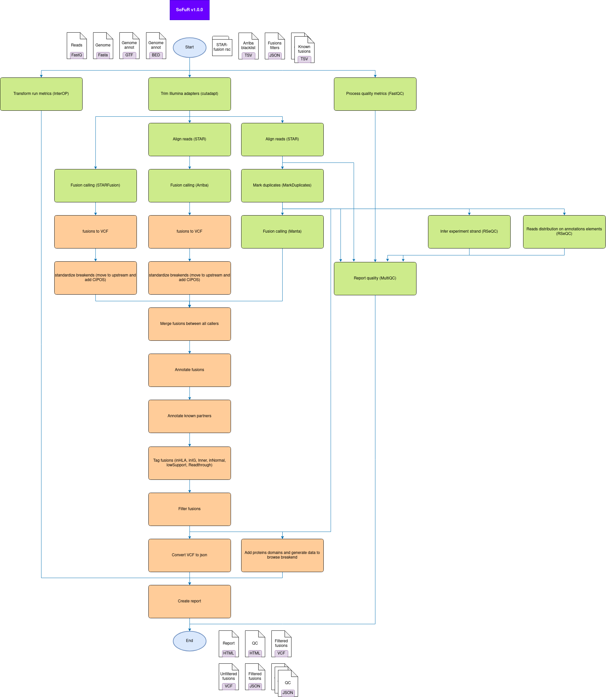

# SoFuR: SOmatic FUsions from Rna

## Table of Contents
* [Description](#description)
* [Workflow steps](#workflow-steps)
* [Installation](#installation)
* [Usage](#usage)
* [Outputs directory](#outputs-directory)
* [Performances](#performances)
* [Copyright](#copyright)

## Description
This workflow detects, annotates and filters somatic fusions from **stranded**
paired-end RNA-seq from short-reads instruments.

## Workflow steps

## Installation
### 1. Download code
Use one of the following:

* [user way] Downloads the latest released versions from
`https://github.com/bialimed/sofur/archive/releases`.
* [developper way] Clones the repository from the latest unreleased version:

      git clone --recurse-submodules git@github.com:bialimed/sofur.git

### 2. Install dependencies
* conda (>=4.6.8):

      # Install conda
      wget https://repo.anaconda.com/miniconda/Miniconda3-latest-Linux-x86_64.sh && \
      sh Miniconda3-latest-Linux-x86_64.sh

      # Install mamba
      conda activate base
      conda install -c conda-forge mamba

  More details on miniconda install [here](https://docs.conda.io/en/latest/miniconda.html).

* snakemake (>=5.4.2):

      mamba create -c conda-forge -c bioconda -n sofur snakemake==6.15.0
      # fix bug with snakemake conda
      conda activate sofur && pip install tabulate==0.8.10 && conda deactivate

  More details on snakemake install [here](https://snakemake.readthedocs.io/en/stable/getting_started/installation.html).

* Install rules dependencies (cutadapt, bwa, ...):

      conda activate sofur
      snakemake \
        --use-conda \
        --conda-prefix ${application_env_dir} \
        --conda-create-envs-only
        --snakefile ${APP_DIR}/Snakefile \
        --configfile workflow_parameters.yml

### 4. Download and prepare resources
SoFuR uses genome sequences, genes annotations, known fusions databanks (artifacts
and pathogenics) and others standard resources. These files must be provided in
your config.yml (see [template](config/workflow_parameters.tpl.yml)).
An detailed example for the creation process of these resources is available
[here](doc/prepare_databanks.md).

### 5. Test install
* From `${APP_DIR}/test/config/wf_config.yml` set variables corresponding to
databanks (see `## ${BANK}/... ##`).

* Launch test wit following command:

      conda activate sofur
      ${APP_DIR}/test/launch_wf.sh \
        ${CONDA_ENVS_DIR} \
        ${WORK_DIR} \
        ${CLUSTER_PARAMS}

  Example with scheduler slurm:

      conda activate sofur
      ~/soft/sofur/test/launch_wf.sh \
        /work/$USER/conda_envs/envs \
        /work/$USER/test_sofur \
        'sbatch --partition={resources.queue} --mem={resources.mem} --cpus-per-task={threads}'

* See results in `${WORK_DIR}/report/run.html`.

## Usage
Copy `${APP_DIR}/config/workflow_parameters.tpl.yml` in your current directory
and change values before launching the following command:

    conda activate sofur
    snakemake \
      --use-conda \
      --conda-prefix ${application_env_dir} \
      --jobs ${nb_jobs} \
      --jobname "sofur.{rule}.{jobid}" \
      --latency-wait 100 \
      --snakefile ${application_dir}/Snakefile \
      --set-threads arriba_star=11 manta_star=11 starFusion=11 \
      --cluster "sbatch --partition={resources.partition} --mem={resources.mem} --cpus-per-task={threads}" \
      --configfile workflow_parameters.yml \
      --directory ${out_dir} \
      > ${out_dir}/wf_log.txt \
      2> ${out_dir}/wf_stderr.txt

## Outputs directory
The main elements of the outputs directory are the following:

    out_dir/
    ├── ...
    ├── report/
    |   ├── ...
    |   ├── run.html
    |   └── sample-A.html
    ├── stats/
    |   ├── ...
    |   └── multiqc/
    |       ├── ...
    |       └── multiqc_report.html
    └── structural_variants/
        ├── ...
        ├── sample-A_unfiltered.vcf
        └── sample-A_filtered.vcf

* The [reports](doc/img/example_EWSR1_FLI1.png) files containing filtered fusions
list, annotations and [viewers](doc/img/example_breakend_viewer.png) are in
`out_dir/report/{sample}.html`.
* The quality reports is in `out_dir/stats/multiqc/multiqc_report.html`. It
resumes qualities of reads, distribution of alignments (between exon, intron,
...) and strandness analysis.
* The annotated fusions in VCF format are kept in `out_dir/structural_variants`.
`*_unfiltered.vcf` contain all the fusions, their annotations and their tags.
`*_filtered.vcf` contain all the fusions, their annotations and their tags after
filtering by rules provided by file declarated in configfile by `filters.rules`.

## Performances
The performances are evaluated on real, synthetic and simulated datasets. The
commands used in evaluation are stored in `assessment`. The results summarized
in [assessment/report.html](assessment/report.html).

## Copyright
2019 Laboratoire d'Anatomo-Cytopathologie du CHU de Toulouse
